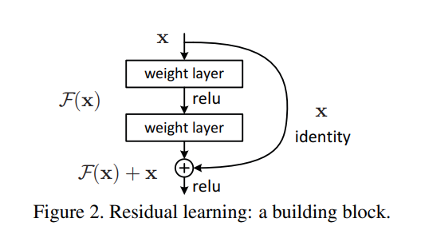
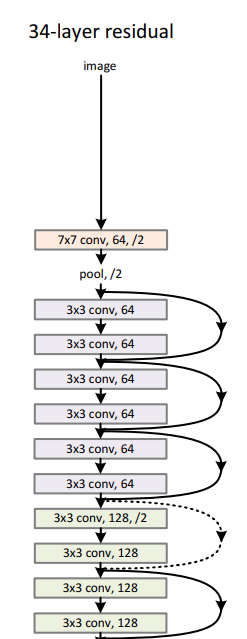
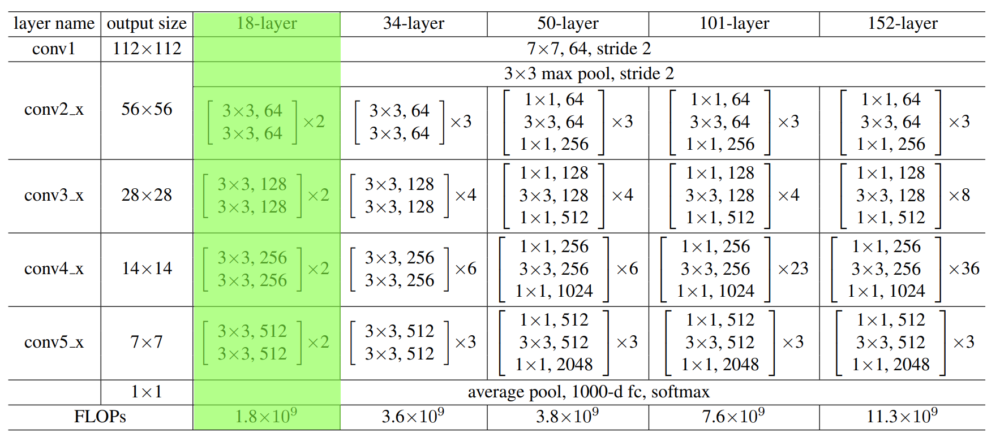

# Training Pytorch 2023
During this training we will :
- Download a dataset with torchvision library...
- Create a CustomDataset from the downloaded dataset
- Create a classifier model
- Create a trainer for this classification model
- Send Logs to tensorboard.

## Installation
In order to use this project, we'll create an environment this way :
```bash
conda create -n torch_training python=3.8
conda activate torch_training
pip install -r requirements.txt
```

# Model
We'll implement a ResNet18.
In the resnet18, we have shortcuts (residual connection).



Blocks are chained like that (example resnet 34)



When there is a downscaling, we can manage the shortcut two ways : 


TO build the resnet18, we'll follow this guidelines :

